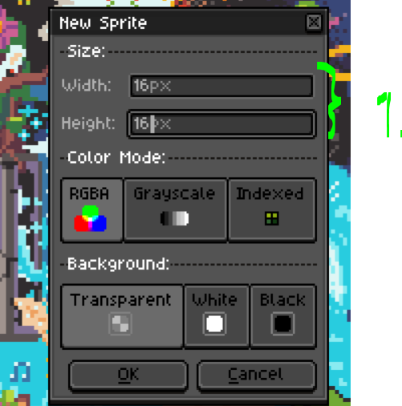
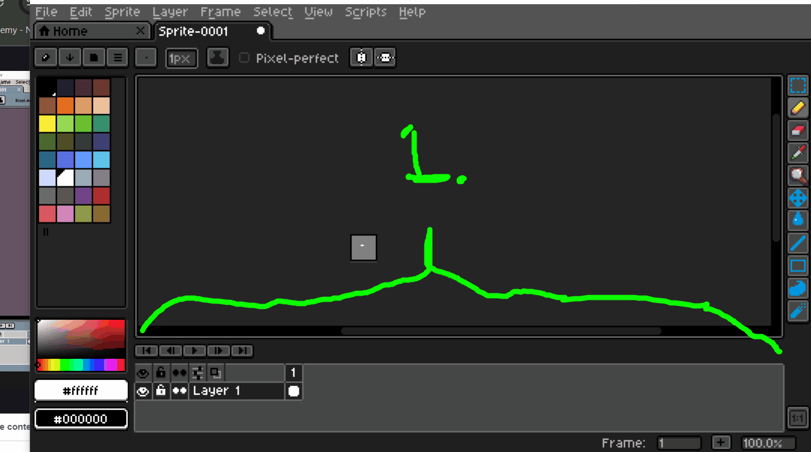
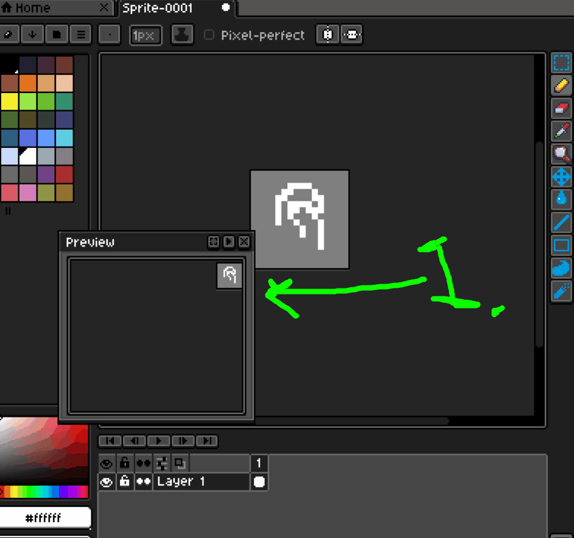
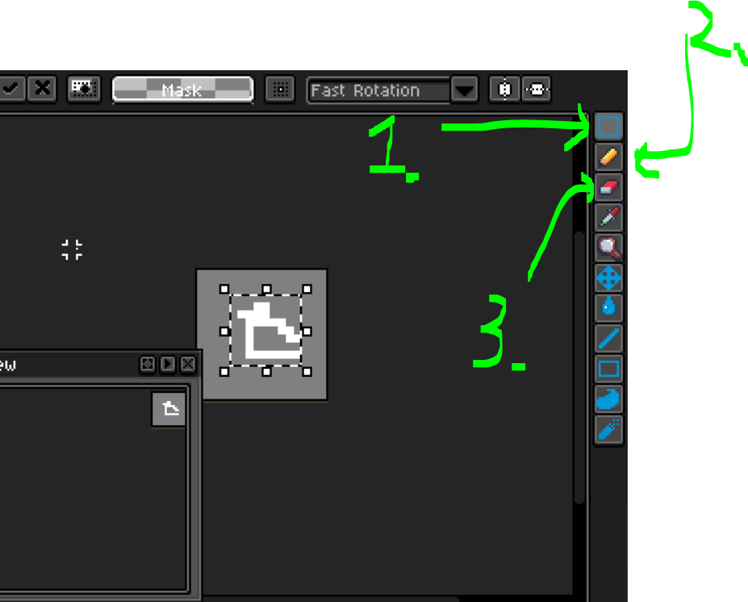
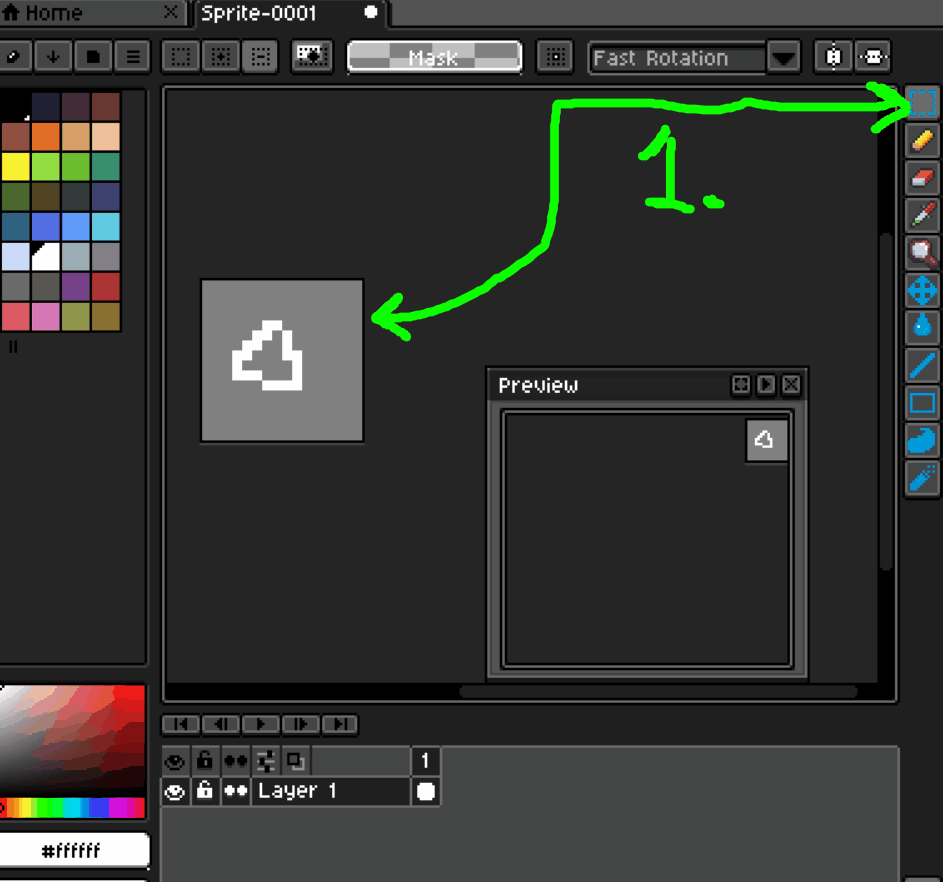
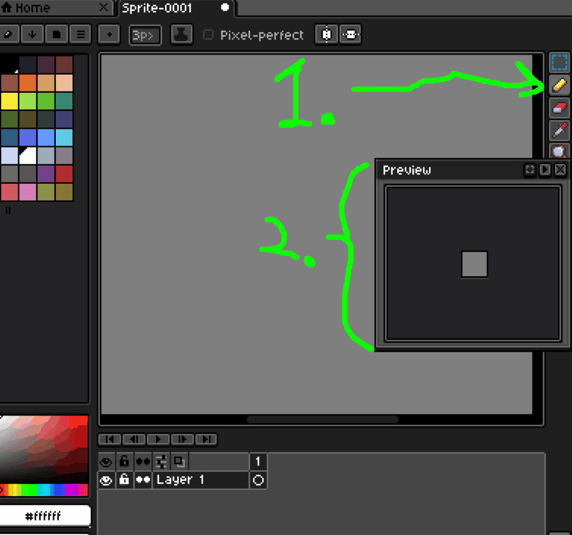
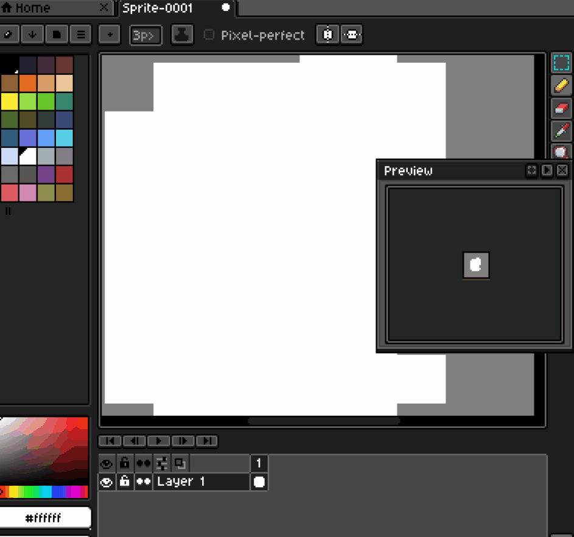
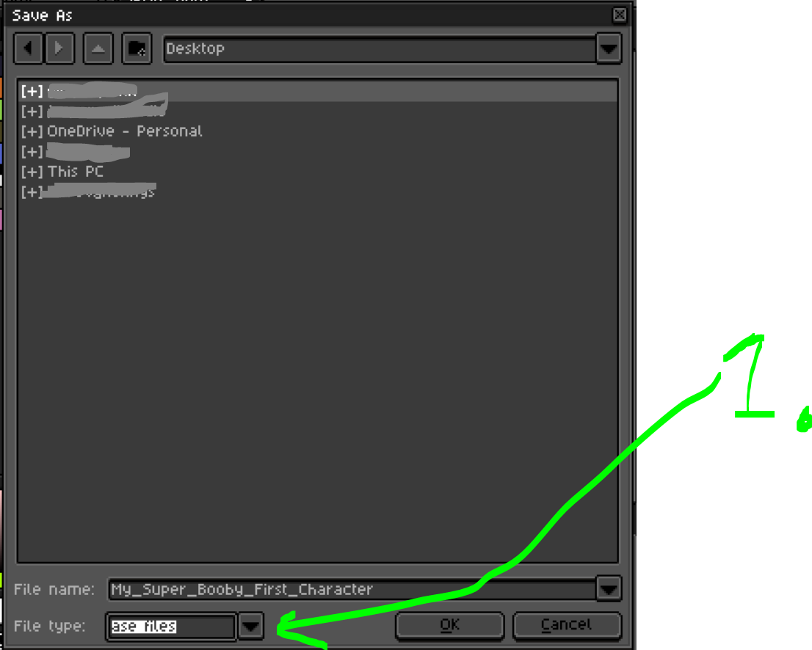
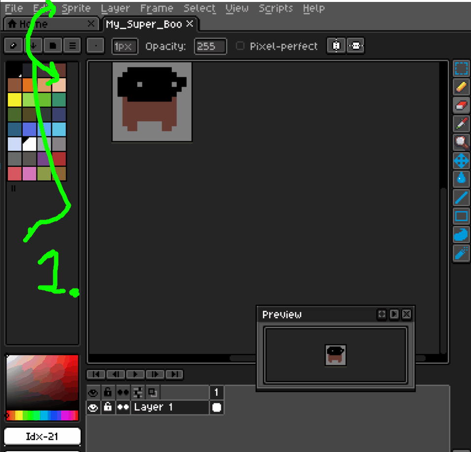
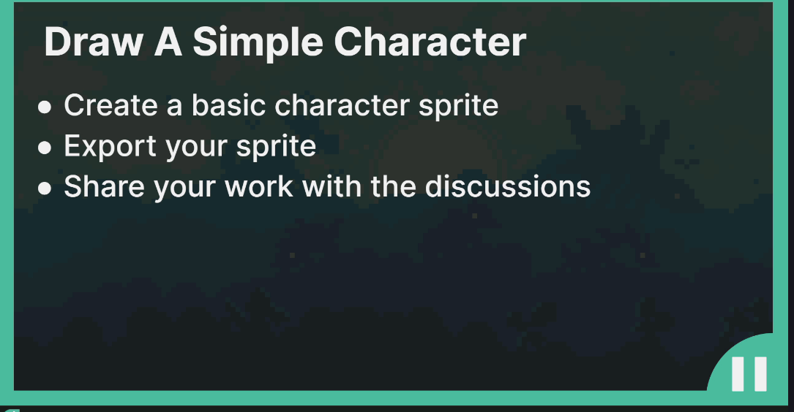

# Section 01: Introduction & Setup.

 Introduction & Setup.

# What I learned.

# Welcome To The Course.

# Download Software.

- We will be using [LibreSprite](https://libresprite.github.io/#!/downloads).
    - Free versions of **Aseprite**.

- Paid version of the **LibreSprite**, used by many pixel art professionals [Aseprite](https://www.aseprite.org/).

- **Gimp** and **Photoshop** are not for beginners!

- Piskel todo

- add here why

- You should have mouse, when going thought this course!

# Community & Support.

- Join the [Facebook groups](https://www.facebook.com/groups/gameartcourse).

- Todo do this to end!

# Getting Started with Libresprite.

> [!TIP]
> In this course we will be using **16x16** for **canvas**.

    

1. We will be having `16px` and `16px` for the canvas!

    

1. This can be opened using `tab`. This is called **timeline**! 
2. This is **preview** tool, with the button `1:1`, its **projection** of canvas into smaller screen!

    

1. Main purpose of the **Preview** is to reflect the changes from canvas!

    

1. **Selection tool**, hotkey `M`.

    

- `1.` We need to select the area!
- `2.` We can move it!
- `3.` We can scale and rotate it!

2. **Pencil tool**, hotkey `B`.

    

- `1.` We are using **pencil too** to draw into canvas!
- `2.` **Notice**, the preview windows usage! Its mostly useful, when **we are zoomed**!

3. **Eraser tool**, hotkey `E`.

    

- We can **erase** things!

- Todo color picker pieace

- Next, how things should be saved:

    

1. One should save it as **ase sprite**, to open it as it is. This is for editing purposes!

    

1. First we **scale** the sprite, since pixel art is **tiny**. `Sprite` → `Sprite Size`.
2. Select the `800%` percentage to make it **8** times bigger.
    - Check to select the `Nearest-neighbor`!
3. Select `.png` file format. This is very flexible file format!

    

# Lighting & Colors.

# Exporting Sprite Sheets.

# Importing Sprite Sheets.

# Top-down vs Platformer Sprites.

# Section Wrap-up – Introduction & Setup.
