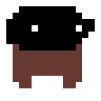
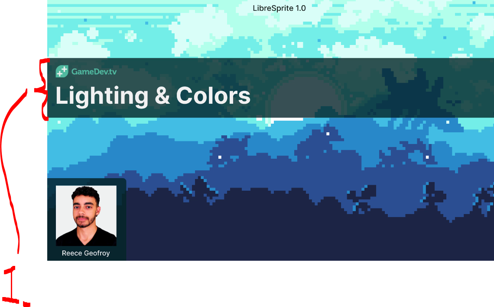
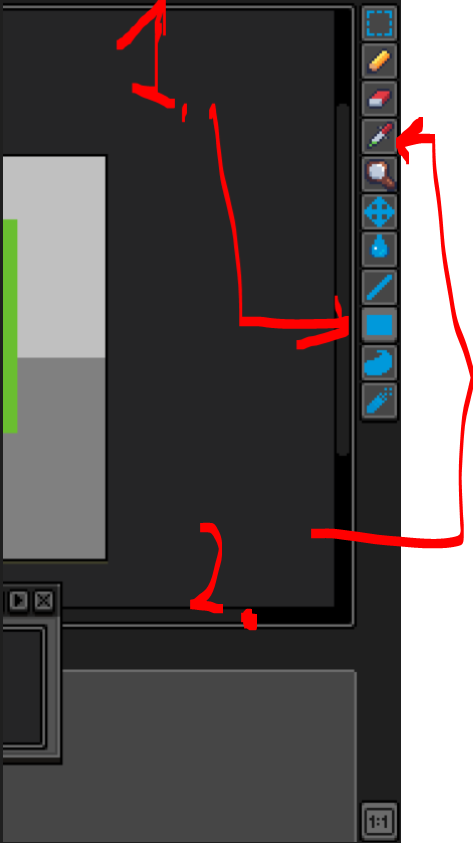
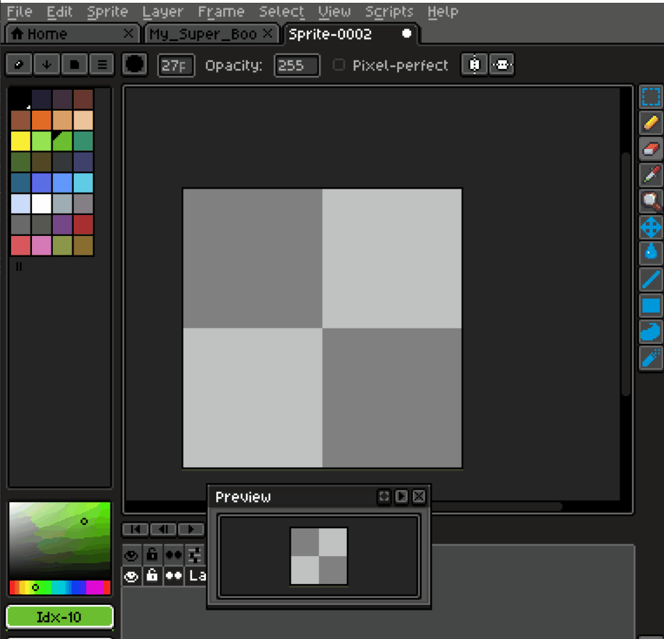
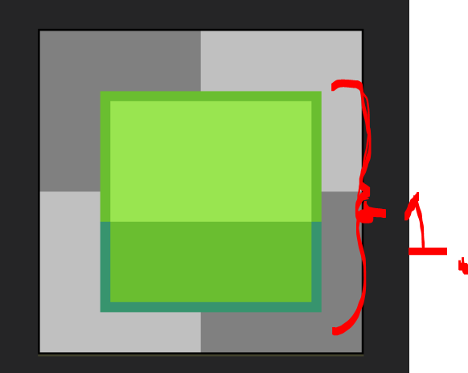
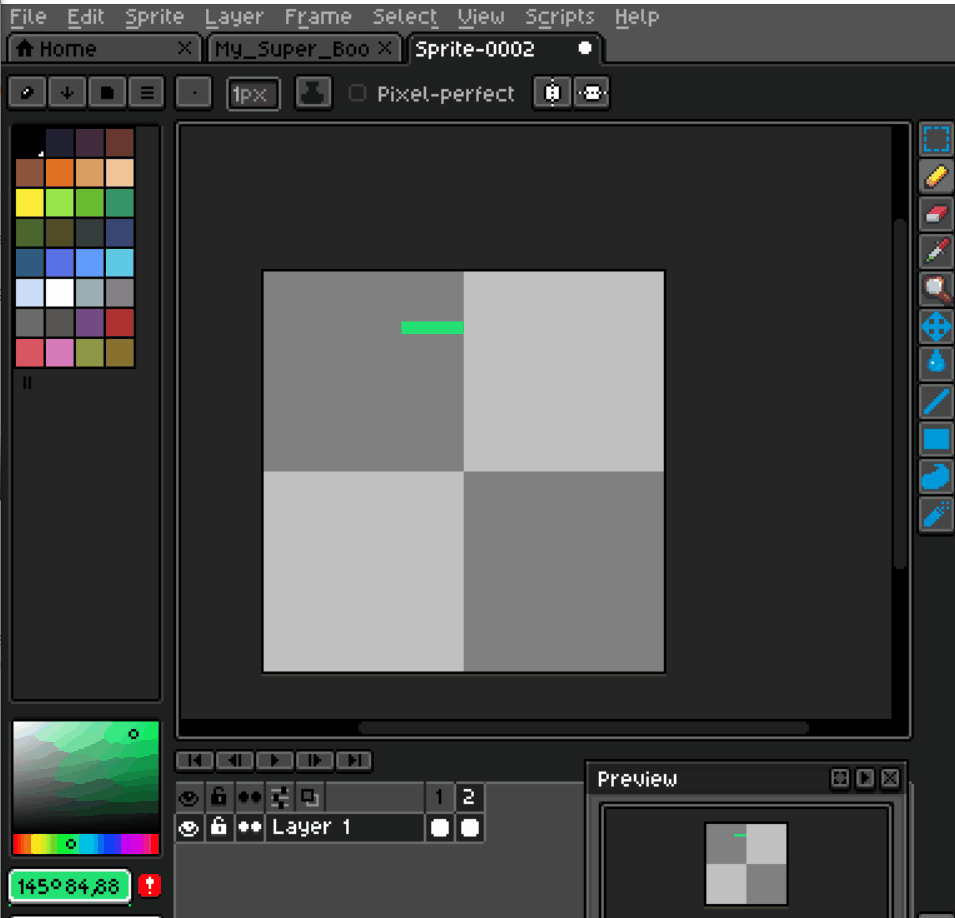
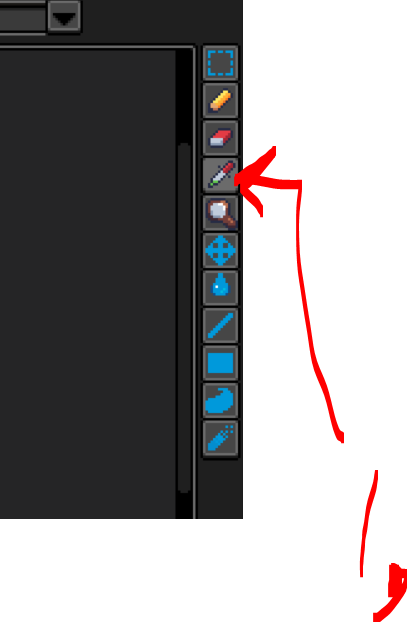
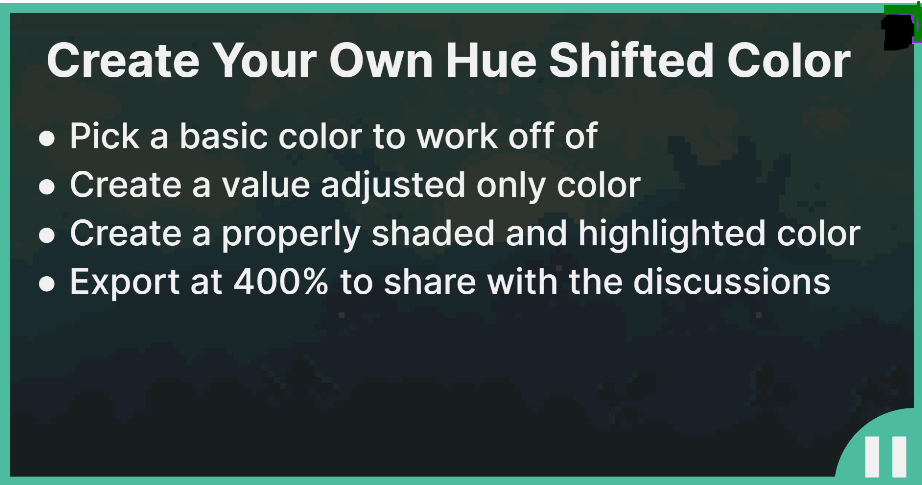

# Section 01: Introduction & Setup.

 Introduction & Setup.

# What I learned.

# Welcome To The Course.

# Download Software.

- We will be using [LibreSprite](https://libresprite.github.io/#!/downloads).
    - Free versions of **Aseprite**.

- Paid version of the **LibreSprite**, used by many pixel art professionals [Aseprite](https://www.aseprite.org/).

- **Gimp** and **Photoshop** are not for beginners!

- Piskel todo

- add here why

- You should have mouse, when going thought this course!

# Community & Support.

- Join the [Facebook groups](https://www.facebook.com/groups/gameartcourse).


- Todo do this to end!

# Getting Started with Libresprite.

> [!TIP]
> In this course we will be using **16x16** for **canvas**.

<div align="center">
    
</div>

1. We will be having `16px` and `16px` for the canvas!

<div align="center">
    
</div>

1. This can be opened using `tab`. This is called **timeline**! 
2. This is **preview** tool, with the button `1:1`, its **projection** of canvas into smaller screen!

<div align="center">
    
</div>

1. Main purpose of the **Preview** is to reflect the changes from canvas!

<div align="center">
    
</div>

1. **Selection tool**, hotkey `M`.

<div align="center">
    
</div>

- `1.` We need to select the area!
- `2.` We can move it!
- `3.` We can scale and rotate it!

2. **Pencil tool**, hotkey `B`.

<div align="center">
    
</div>

- `1.` We are using **pencil too** to draw into canvas!
- `2.` **Notice**, the preview windows usage! Its mostly useful, when **we are zoomed**!

3. **Eraser tool**, hotkey `E`.

<div align="center">
    
</div>

- We can **erase** things!

- Todo color picker pieace

- Next, how things should be saved:

<div align="center">
    
</div>

1. One should save it as **ase sprite**, to open it as it is. This is for editing purposes!

<div align="center">
    
</div>

1. First we **scale** the sprite, since pixel art is **tiny**. `Sprite` → `Sprite Size`.
2. Select the `800%` percentage to make it **8** times bigger.
    - Check to select the `Nearest-neighbor`!
3. Select `.png` file format. This is very flexible file format!

<div align="center">
    
</div>

<details>
<summary id="Assigment 01
" open="true" alt="Pixel tool"> <b> First assigment - my answer! </b> </summary>

```yaml
Task as text:

Draw A Simple Character.
• Create a basic character sprite.  
• Export your sprite.
• Share your work with the discussions.
```

<div align="center">
    
</div>

</details>

# Lighting & Colors.

<div align="center">
    
</div>


1. We will be making **own color**, with the wheel. How to create own shading!

- We will be trying to give **depth** using shading!

<div align="center">
    
</div>

1. **Rectangle tool** `U`. We can repeat this key, we can transfer between **filled rectangle** and **rectangle**!

<div align="center">
    
</div>

1. We are using the `U` to switch here between, **filled rectangle** and **rectangle**.
2. We are using **filled rectangle**!

- Furthermore, we can add **New Empty Frame** as following.

<div align="center">
    
</div>

1. Press the small number.
    - We can add the **New Empty Frame** to the animation tool!

<div align="center">
    
</div>

1. We can achieve the **dept** in the picture using the shades!

- Example drawing **three** layers, by changing the colors.

<div align="center">
    
</div>

1. **Beginners** usually changes the colors based on the *"hand"* felling!
    - You can see here **three** changes on the **color palette**!
        - Every change will a little bit darker!

<div align="center">
    
</div>

1. We can use p

<div align="center">
    
</div>

<details>
<summary id="Assigment 02
" open="true" alt="Pixel tool"> <b> Second assigment - my answer! </b> </summary>

```yaml
Task as text:

- todo add as text here.

```

<div align="center">
    
</div>

</details>


# Exporting Sprite Sheets.

# Importing Sprite Sheets.

# Top-down vs Platformer Sprites.

# Section Wrap-up – Introduction & Setup.
