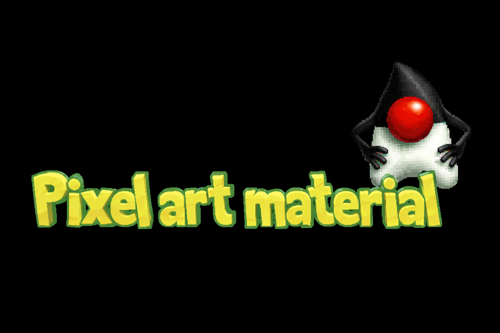
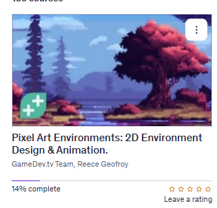

    
    <text> This will contains pixel art related topics!</text>

   

- For these courses one should configure **GIT** for handle projects.
    - `git config --global http.postBuffer 524288000`.
    - `git config --global core.longpaths true`.

<!-- 

    

 -->

# Pixel Art Master Course Beginner To Professional Freelance Description.

    

All course material from *Pixel Art Master Course - Beginner to Professional/Freelance* by **Mislav Majdandžić**.

> Add here some stoy!  
~ *DevelopersCradle*

Contains my own notes with some course material to enforce learning experience.

[The course at Udemy](https://www.udemy.com/course/pixel-art-master-course/). 

[Homepage](https://www.1bitstudio.com/). 

If the content sparked :fire: your interest, please consider buying the course and start learning :book:.

<!-- 
Linkedin puts this shit front, when clicking from private mode x(. Need to put this to make jump working every case
?trk=public_profile_see-credential 
-->

    certficate goes here

**Note: The material provided in this repository is only for helping those who may get stuck at any point of time in the course. It is very advised that no one should just copy the solutions(violation of Honor Code) presented here.**

#### Progress/Curriculum.

- [ ] [Section 01](#) - Getting started.
- [ ] [Section 02](#) - Lines and Shapes [B].
- [ ] [Section 03](#) - Shading and lighting [B].
- [ ] [Section 04](#) - Colours and textures [B].
- [ ] [Section 05](#) - Drawing simple objects [B].
- [ ] [Section 06](#) - Tiles [B].
- [ ] [Section 07](#) - Backgrounds [B].
- [ ] [Section 08](#) - Basic characters [B].
- [ ] [Section 09](#) - Simple animation [B].
- [ ] [Section 10](#) - Platformer View [I].
- [ ] [Section 11](#) - Top Down View [I].
- [ ] [Section 12](#) - RPG View [I].
- [ ] [Section 13](#) - Isometric View [I].
- [ ] [Section 14](#) - Intermediate Shading [I].
- [ ] [Section 15](#) - Materials [I].
- [ ] [Section 16](#) - Checkpoint before Advanced Lessons.
- [ ] [Section 17](#) - 12 Principles of Animation - with Game Design explanations.

#### Additional stuff.

- [ ] Add some.

#### The Quizzes and Labs.

* **Section 01**:
    * *Quiz*:
        * [Some here](#).
    * *Coding Exercise*:
        * [Coding Exercise 01 here](#).

# Pixel Art Environments: 2D Environment Design & Animation.

    

All course material from *Pixel Art Environments: 2D Environment Design & Animation* by **Reece Geofroy** and **gamedev.tv**. 

> Add here some story!  
add story to take part on the game race form the gamedev
~ *DevelopersCradle*

Contains my own notes with some course material to enforce learning experience. Art cannot taught by reading books or material, if one feels inspired check the course online!

[The course at Udemy](https://www.udemy.com/courses/search/?src=ukw&q=Pixel+Art+Environments%3A+2D+Environment+Design+%26+Animation.). 
- At the time, this was on the Udemy. Just search it.

[GameDev](https://gamedev.tv/courses/pixel-art-environments). 

If the content sparked :fire: your interest, please consider buying the course and start learning :book:.

<!-- 
Linkedin puts this shit front, when clicking from private mode x(. Need to put this to make jump working every case
?trk=public_profile_see-credential 
-->

    certficate goes here

**Note: The material provided in this repository is only for helping those who may get stuck at any point of time in the course. It is very advised that no one should just copy the solutions(violation of Honor Code) presented here.**

#### Progress/Curriculum.

- [ ] [Section 01](https://github.com/developersCradle/pixel-art/tree/main/Pixel%20Art%20Environments%202D%20Environment%20Design%20and%20Animation/Section%2001#section-01-introduction--setup) - Introduction & Setup.
- [ ] [Section 02](https://github.com/developersCradle/pixel-art/tree/main/Pixel%20Art%20Environments%202D%20Environment%20Design%20and%20Animation/Section%2002#section-02-creating-tilesets--assets) - Creating Tilesets & Assets.
- [ ] [Section 03](https://github.com/developersCradle/pixel-art/tree/main/Pixel%20Art%20Environments%202D%20Environment%20Design%20and%20Animation/Section%2003#section-03-designing-backgrounds) - Designing Backgrounds.
- [ ] [Section 04](https://github.com/developersCradle/pixel-art/tree/main/Pixel%20Art%20Environments%202D%20Environment%20Design%20and%20Animation/Section%2004#section-04-polishing-environments) - Polishing Environments.
- [ ] [Section 05](https://github.com/developersCradle/pixel-art/tree/main/Pixel%20Art%20Environments%202D%20Environment%20Design%20and%20Animation/Section%2005#section-05-continuing-your-gamedev-journey) - Continuing Your GameDev Journey.

#### Additional stuff.

- [ ] Add some.

#### The Quizzes and Labs.

* **Section 01**:
    * *Painting Exercise*:
        * [Painting Exercise 01 - My First poppy guy](#).

